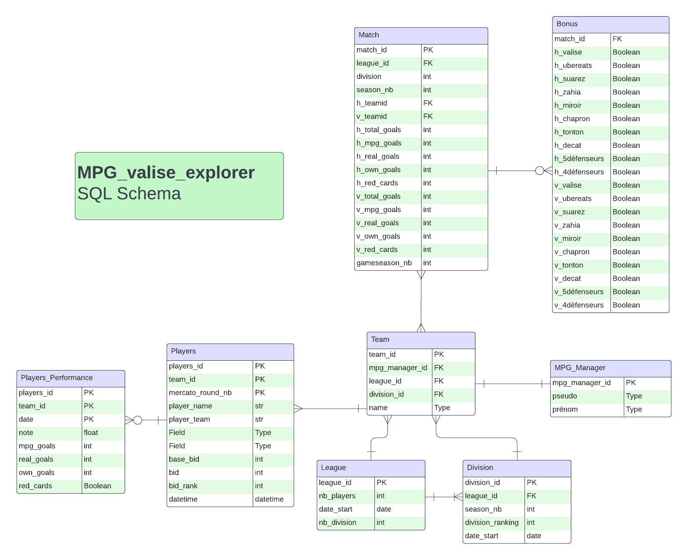

# MPG Football Scraper

A Python script for scraping data from the MPG (Mon Petit Gazon) website.

## Table of Contents

- [Introduction](#introduction)
- [Prerequisites](#prerequisites)
- [Installation](#installation)
- [Configuration](#configuration)
- [Usage](#usage)
- [Database Architecture](#database-architecure)
- [License](#license)

## Introduction

This Python script is designed to scrape data from the MPG (Mon Petit Gazon) website, allowing you to extract and analyze various statistics related to your fantasy football leagues. It utilizes the `requests` library for making HTTP requests and `BeautifulSoup` for parsing HTML.
The aim of this project is to provide new metrics for your seasons, so you'll finally know if your opponent has a mirror left, or who was the luckiest last season! 

## Prerequisites

Before using the script, make sure you have the following installed:

- Python (version 3.10 or higher)
- An MPG league

## Installation

1. Clone the repository:

```bash
git clone https://github.com/yourusername/mpg-football-scraper.git
cd mpg-football-scraper
```

2. Install dependencies:

```bash
pip install -r requirements.txt
```

## Configuration

Before running the script, update the `config.ini` file with your MPG credentials:

```text
[credentials]
username = your_username
password = your_password
```

Make sure to keep your credentials secure and do not share them publicly.

## Usage

Run the script by executing the following command:

```bash
python scraper.py
```

This will authenticate your account on MPG and retrieve data from the specified league.

## Database Architecture

Here is the database architecture for the MPG Football Scraper:



## License

This project is unlicensed, but don't hesitate to contact me if you have any problems using it :)
